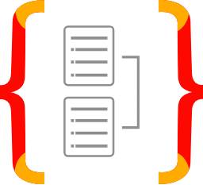
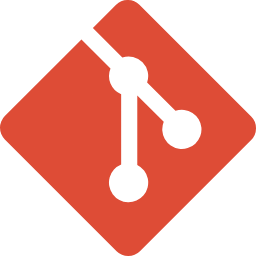

<h1>Simple Task Manager</h1>

<h1>Notes:</h1>

[01] This is a simple task manager backend application

[02] All endpoints listed in postman collection json file

[03] All environment variables needed listed inside the docker compose file
